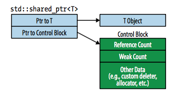

# Item 19: 使用srd::shared_ptr来管理共享所有权的资源 


本文翻译自《effective modern C++》，由于水平有限，故无法保证翻译完全正确，欢迎指出错误。谢谢！
博客已经迁移到这里啦

使用带垃圾回收机制语言的程序员指出并嘲笑C++程序员需要遭受防止资源泄漏的痛苦。“多么原始啊”他们嘲笑道，“20世纪60年代的Lisp留下的备忘录你还不记得了吗？机器（而不是人类）应该管理资源的生命周期”。C++开发人员转了转他们的眼睛，“你所说的备忘录是指，那些资源只有内存以及资源的回收时间不确定的时候吗？我们更喜欢比较普遍以及可预测的析构函数，谢谢你。”但是我们只是虚张声势而已。垃圾回收机制确实很方便，而且手动的生命周期管理确实看起来像：使用石刀和熊皮来构造一个记忆存储电路（意味着几乎不可能的任务，constructing a mnemonic memory circuit using 
stone knives and bear skins，出自星际迷途）。为什么我们不能同时拥有两个世界的精华部分呢：创造一个系统，这个系统能自动工作（比如垃圾回收机制），还能应用到所有资源上以及能拥有可预测的生命周期（比如析构函数）？

C++11中是用std::shared_ptr把两个世界的优点绑定在一起的。通过std::shared_par可以访问对象，这个对象的生命周期由智能指针以共享所有权的语义来管理。没有一个明确的std::shared_ptr占有这个对象。取而代之的是，所有指向这个对象的std::shared_ptr一起合作来确保：当这个对象不再被需要的时候，它能被销毁。当最后一个指向对象的std::shared_ptr不再指向这个对象（比如，因为std::shared_ptr被销毁了或者指向了别的对象）std::shared_ptr会销毁它指向的对象。就像垃圾回收机制一样，客户不需要管理被指向的对象的生命周期了，但是和析构函数一样，对象的销毁的时间是确定的。

通过查看引用计数（reference count，一个和资源关联的值，这个值能记录有多少std::shared_ptr指向资源），一个std::shared_ptr能告诉我们它是否是最后一个指向这个资源的指针。std::shared_ptr的构造函数会增加引用计数（通常，而不是总是，请看下面），std::shared_ptr的析构函数会减少引用计数，拷贝operator=既增加也减少（如果sp1和sp2是指向不同对象的std::shared_ptr，赋值操作“sp1 = sp2”会修改sp1来让它指向sp2指向的对象。这个赋值操作最后产生的效果就是：原本被sp1指向的对象的引用计数减少了，同时被sp2指向的对象的引用计数增加了。）如果一个std::shared_ptr看到一个引用计数在一次自减操作后变成0了，这就意味着没有别的std::shared_ptr指向这个资源了，所以std::shared_ptr就销毁它了。

引用计数的存在带来的性能的影响：

- std::shared_ptr是原始指针的两倍大小，因为它们在内部包含了一个指向资源的原始指针，同时包含一个指向资源引用计数的原始指针。
- 引用计数的内存必须动态分配。概念上来说，引用计数和被指向的资源相关联，但是被指向的对象不知道这件事。因此它们没有地方来存放引用计数。（这里隐含一个令人愉快的提示：任何对象，即使是built-in类型的对象都能被std::shared_ptr管理）Item 21解释了，当使用std::make_shared来创建std::shared_ptr时，动态分配的花费能被避免，但是这里有一些无法使用std::make_shared的情况。不管哪种方式，引用计数被当成动态分配的数据来存储。
- 引用计数的增加和减少操作必须是原子的，因为在不同的线程中可能同时有多个reader和writer。举个例子，在某个线程中指向的一个资源的std::shared_ptr正在调用析构函数（因此减少它指向的资源的引用计数），同时，在不同的线程中，一个指向相同资源的std::shared_ptr被拷贝了（因此增加了资源的引用计数）。原子操作通常比非原子操作更慢，所以即使引用计数常常只有一个字节的大小，你应该假设对它们的读写是相当费时的。

不知道我之前写的“std::shared_ptr的构造函数只是“通常”增加它指向的对象的引用计数”有没有刺激到你的好奇心。创建一个指向某个对象的std::shared_ptr总是产生一个额外std::shared_ptr指向这个对象，所以为什么我们不能总是增加它的引用计数呢？

move构造函数，这就是原因。从另外一个std::shared_ptr移动构造一个std::shared_ptr会设置源std::shared_ptr为null，这意味着旧的std::shared_ptr停止指向资源的同时新的std::shared_ptr开始指向资源。所以，它不需要维护引用计数。因此move std::shared_ptr比拷贝它们更快：拷贝需要增加引用计数，但是move不会。这对赋值操作来说也是一样的，所以move构造比起拷贝构造更快，move operator=比拷贝operator=更快。

和std::unique_ptr(看Item 18)相似的是，std::shared_ptr使用delete作为它默认的资源销毁机制，但是它也能支持自定义的deleter。但是，它的设计和std::unique_ptr不一样。对于std::unique_ptr来说，deleter的类型是智能指针类型的一部分。但是对std::shared_ptr来说，它不是：
```cpp
auto loggingDel = [] (Widget *pw)           //自定义deleter
                 {
                    makeLogEnty(pw);
                    delete pw;
                 }

std::unique_ptr<                        //deleter的类型是指针
    Widget, decltype(loggingDel)        //类型的一部分
    > upw(new Widget, loggingDel);

std::shared_ptr<Widget>                 //deleter的类型不是指针
    spw(new Widget, loggingDel);        //类型的一部分
```
std::shared_ptr的设计更加灵活。考虑一下两个std::shared_ptr，它们带有不同的自定义deleter。（比如，因为自定义deleter是通过lambda表达式确定的）：

```cpp
auto customDeleter1 = [](Widget *pw) { ... };       //自定义deleter
auto customDeleter2 = [](Widget *pw) { ... };       //不同的类型

std::shared_ptr<Widget> pw1(new Widget, customDeleter1);
std::shared_ptr<Widget> pw2(new Widget, customDeleter2);
```
因为pw1和pw2有相同类型，它们能被放在同一个容器中：

```cpp
std::vector<std::shared_ptr<Widget>> vpw{ pw1, pw2 };
```
它们能互相赋值，并且它们都能被传给一个函数作为参数，只要这个函数的参数是std::shared_ptr类型。这些事使用std::unique_ptr（根据自定义deleter来区分类型）都做不到，因为自定义deleter的类型会影响到std::unique_ptr的类型。

另外一个和std::unique_ptr不同的地方是，指定一个自定义deleter不会改变一个std::shared_ptr对象的大小。无论一个deleter是什么，一个std::shared_ptr对象都是两个指针的大小。这是一个好消息，但是它也会让你隐约感到一点不安。自定义deleter可以是一个仿函数，并且仿函数能包含任意多的数据。这意味着它们能变得任意大。那么一个std::shared_ptr怎么能指向一个任意大小的deleter却不使用任何内存呢？

它不能，它必须要用更多的内存。但是，这些内存不是std::shared_ptr对象的一部分。它在堆上，或者，如果一个std::shared_ptr的创造者利用std::shared_ptr支持自定义内存分配器的特性来优化它，那么它就在内存分配器管理的内存中。我之前提过一个std::shared_ptr对象包含一个指向引用计数（std::shared_ptr指向的对象的引用计数）的指针。这是对的，但是我有点误导你了，因为，引用计数只是更大的数据结构（被称为控制块（control block））的一部分。每一个被std::shared_ptr管理的对象都有一个控制块。除了引用计数，控制块还包含：一个自定义deleter的拷贝（如果有的话），一个自定义内存分配器的拷贝（如果有的话），额外的数据（包括weak count， Item 21中解释的第二个引用计数，但是我们在本Item中会忽略这个数据）。我们能把和std::shared_ptr对象关联的内存模型想象成这个样子：



一个对象的控制块是被指向这个对象的第一个std::shared_ptr创建的。至少这是应该发生的。通常，一个创建std::shared_ptr的函数是不可能知道是否有其他std::shared_ptr已经指向这个对象了，所以控制块的创建遵循这些规则：

- std::make_shared(看Item 21)总是创建一个控制块，它制造一个新对象，所以可以肯定当std::make_shared被调用的时候，这个对象没有控制块。
- 当从一个独占所有权的指针（也就是，一个std::unique_ptr或std::auto_ptr）构造一个std::shared_ptr对象时，创造一个控制块。独占所有权的指针不使用控制块，所以被指向的对象没有控制块。（作为构造的一部分，std::shared_ptr需要承担被指向对象的所有权，所以独占所有权的指针被设置为null）
- 当使用一个原始指针调用std::shared_ptr的构造函数构造函数时，它创造一个控制块。如果你想使用一个已经有控制块的对象来创建一个std::shared_ptr的话，你可以传入一个std::shared_ptr或一个std::weak_ptr(看Item 20)作为构造函数的参数，但不能传入一个（这个已经有控制块的对象的）原始指针。使用std::shared_ptr或std::weak_ptr作为构造函数的参数不会创建一个新的控制块，因为它们能依赖传入的智能指针来指向必要的控制块。

这些规则导致的一个结果就是：用一个原始指针来构造超过一个的std::shared_ptr对象会让你免费坐上通往未定义行为的粒子加速器，因为被指向的对象会拥有多个控制块。多个控制块就意味着多个引用计数，多个引用计数就意味着对象会被销毁多次（一个引用计数一次）。这意味着这样的代码是很糟糕很糟糕很糟糕的：

```cpp
auto pw = new Widget;                           //pw是原始指针

...

std::shared_ptr<Widget> spw1(pw, loggingDel);   //创建一个*pw的控制块

...

std::shared_ptr<Widget> spw2(pw, loggingDel);   //创建第二个*pw的控制块
```
创建一个原始指针pw指向动态分配的对象是不好的，因为它和这一整章的建议相违背：比起原始指针优先使用智能指针（如果你已经忘记这个建议的动机了，在115页刷新一下你的记忆）但是先把它放在一边。创建pw的这一行在格式上是令人厌恶的，但是至少它不会造成未定义的程序行为。

现在，用原始指针调用spw1的构造函数，所以它为指向的对象创建了一个控制块（因此也创建了一个引用计数）。在这种情况下，被指向对象就是`*pw`（也就是pw指向的对象）。就其本身而言，这是可以的，但是spw2的构造函数的调用，使用的是同样的原始指针，所以它也为`*pw`创建一个控制块（因此又创建了一个引用计数）。因此`*pw`有两个引用计数，每个引用计数最终都会变成0，并且这最终将企图销毁`*pw`两次。第二次销毁会造成未定义行为。

关于std::shared_ptr的使用，上面的例子给我们两个教训。第一，尽量避免传入一个原始指针给一个std::shared_ptr的构造函数。通常的替换品是使用std::make_shared(看Item 21)，但是在上面的例子中，我们使用了自定义deleter，那就不能使用std::make_shared了。第二，如果你必须传入一个原始指针给std::shared_ptr的构造函数，那么用“直接传入new返回的结果”来替换“传入一个原始指针变量”。如果上面的代码的第一部分被写成这样：

```cpp
std::shared_ptr<Widget> spw1(new Widget, loggingDel);   //直接使用new
```
这样就没有来自“使用同样的原始指针来创建第二个std::shared_ptr”的诱惑了。取而代之的是，代码的作者会很自然地使用spw1做为一个初始化参数来创建spw2（也就是，将调用std::shared_ptr的拷贝构造函数），并且这将不会造成任何问题：

```cpp
std::shared_ptr<Widget> spw2(spw1);     //spw2使用的控制块和spw1一样
```
使用原始指针变量作为std::shared_ptr构造函数的参数时，有一个特别让人惊奇的方式（涉及到this指针）会产生多个控制块。假设我们的程序使用std::shared_ptr来管理Widget对象，并且我们有一个数据结构保存处理过的Widget：

```cpp
std::vector<std::shared_ptr<Widget>> processedWidgets;
```
进一步假设Widget有一个成员函数来做相应的处理：

```cpp
class Widget {
public:
    ...
    void process();
    ...
};
```
这里有一个“看起来合理”的方法能用在Widget::process上：

```cpp
void Widget::process()
{
    ...                                     //处理Widget

    processedWidgets.emplace_back(this);    //把它加到处理过的Widget的
                                            //列表中去，这是错误的！
}
```
注释上说这会产生错误已经说明了一切（或者大部分事实，错误的地方是传入this，而不是emplace_back的使用。如果你不熟悉emplace_back，请看Item 42），这段代码能编译，但是它传入一个原始指针（this）给一个std::shared_ptr的容器。因此std::shared_ptr的构造函数将为它指向的Widget（`*this`）创建一个新的控制块。That doesn’t sound harmful until you realize that if there are std::shared_ptrs outside the member function that already point to that Widget, it’s game, set, and match for undefined behavior.直到你意识到如果在成员函数外面已经有std::shared_ptr指向这个Widget前，这听起来都是无害的，这是对未定义行为的赌博，设置以及匹配。

std::shared_ptr的API包括一个为这种情况专用的工具。它有着标准C++库所有名字中有可能最奇怪的名字：std::enable_shared_from_this。如果你想要一个类被std::shared_ptr管理，你能继承自这个基类模板，这样就能用this指针安全地创建一个std::shared_ptr。在我们的例子中，Widget应该像这样继承std::enable_shared_form_this：
```cpp
class Widget: public std::enable_shared_from_this<Widget> {
public:
    ...
    void process();
    ...
};
```
就像我之前说的，std::enable_shared_from_this是一个基类模板。它的类型参数总是派生类的名字，所以Widget需要继承一个std::enable_shared_from_this。如果“派生类继承的基类需要用派生类来作为模板参数”让你感到头疼的话，不要去思考这个问题。代码是完全合理的，并且这背后是已经建立好的一个设计模式，它有一个标准的名字，虽然这个名字几乎和std::enable_shared_from_this一样奇怪。名字是“奇特的递归模板模式”（The Curiously Recurring Template 
Pattern， 简称CRTP）。如果你想要学一下这个方面的知识的话，打开你的搜索引擎把，因为在这里，我们需要回到std::enable_shared_from_this。

std::enable_shared_from_this定义一个成员函数来创建一个指向正确对象的std::shared_ptr，但是它不复制控制块。成员函数是shared_from_this，并且当你想让std::shared_ptr指向this指针指向的对象时，你可以在成员函数中使用它。这里给出Widget::process的安全实现：

```cpp
void Widget::process()
{
    //和以前一样，处理Widget
    ...

    //把指向当前对象的std::shared_ptr增加到processedWidgets中去
    processedWidgets.emplace_back(shared_from_this());
}
```
在其内部，shared_from_this查找当前对象的控制块，并且创建一个新的std::shared_ptr并让它指向这个控制块。这个设计依赖于当前的对象已经有一个相关联的控制块了。这样的话，这里就必须有一个存在的std::shared_ptr（比如，一个调用shared_from_this的成员函数的外部）指向当前的对象。如果没有这样的std::shared_ptr存在（也就是如果当前对象没有和任何控制块关联），即使shared_from_this通常会抛出一个异常，它的行为还将是未定义的。

为了防止客户在一个std::shared_ptr指向这个对象前，调用成员函数（这个成员函数调用了shared_from_this），继承自std::enable_shared_from_this的类常常声明它们的构造函数为private，并且让客户通过调用一个返回std::shared_ptr的工厂函数来创建对象，举个例子，看起来像这样：

```cpp
class Widget: public std::enable_shared_from_this<Widget> {
public:
    //工厂函数，完美转发参数给一个private
    //构造函数

    template<typename... Ts>
    static std::shared_ptr<Widget> create(Ts&&... params);

    ...
    void process();
    ...

private:
    ...                 //构造函数
};
```
现在，你可能只能模糊地回想起我们对控制块的讨论是出于：理解和std::shared_ptr有关的费用。现在我们理解了怎么避免创建太多的控制块，让我们回到原始的话题。

一个控制块通常只有几个字节的大小，尽管自定义deleter和自定义内存分配器能让它变得更大。控制块的通常实现可能比你想象的要更加复杂。它利用继承，甚至一个虚函数（用来确保指向的对象被正确地销毁）这意味着使用std::shared_ptr也会招致使用虚函数（被控制块使用）的成本。

读了关于动态分配控制块，任意大的deleter和内存分配器，虚函数机制，以及原子引用计数操作。你对std::shared_ptr的热情可能多少已经衰减了。很好，它们不是每一种资源管理问题的最好解决办法。但是为了它们提供的功能，std::shared_ptr的这些付出还是合理的。在典型的条件下，当使用默认deleter以及默认内存分配器，并且使用std::make_shared来创建std::shared_ptr时，控制块只有3字节的大小，并且它的分配本质上是免费的（这包括被指向的对象的内存的分配，细节部分看Item 21）解引用一个std::shared_ptr不会比解引用一个原始指针更昂贵。执行一个需要改动引用计数的操作（比如，拷贝构造函数或拷贝operator=，析构函数）需要承担一个或两个原子操作，但是这些操作通常被映射到独立的机器指令上，所以即使他们可能比起非原子指令更昂贵，但是他们仍然是单条指令。控制块中的虚函数机制，在每个被std::shared_ptr管理的对象中只使用一次：对象销毁的时候。

用这些适度的花费作为交换，你能得到的是，对动态分配资源的生命周期的自动管理。大多数时候，对于共享所有权的对象的生命周期，比起手动管理来说，使用std::shared_ptr是更好的选择。如果你发现你在纠结是否承担得起std::shared_ptr所带来的负担，你需要再考虑一下你是否真的需要共享所有权。如果独享所有权能够做到的话，std::unique_ptr是更好的选择。它的性能状况和原始指针是很接近的，并且从std::unique_ptr“升级”到std::shared_ptr也很简单，因为一个std::shared_ptr能使用一个std::unique_ptr来创建。

反过来就不对了。一旦你已经把对资源的生命周期的管理交给了std::shared_ptr，你的想法就不能再改变了。即使它的引用计数是1，你也不能改变资源的所有权，也就是说，让一个std::unique_ptr来管理它。std::shared_ptr和资源之间的所有权合同指出它是“死前永远在一起”的类型，没有分离，没有取消，没有分配。

另外std::shared_ptr不能和数组一起工作。到目前为止这是另外一个和std::unique_ptr不同的地方，std::shared_ptr的API被设计为只能作为单一对象的指针。这里没有std::shared_ptr

## 你要记住的事
- std::shared_ptr提供和垃圾回收机制差不多方便的方法，来对任意的资源进行共享语义的生命周期管理。
- 比起std::unique_ptr，std::shared_ptr对象常常是它的两倍大，需要承担控制块的间接费用，并且需要原子的引用计数操作。
- 默认的资源销毁操作是通过delete进行的，但是自定义deleter是支持的。deleter的类型不会影响到std::shared_ptr的类型。
- 避免从原始指针类型的变量来创建std::shared_ptr。
