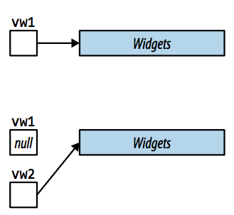
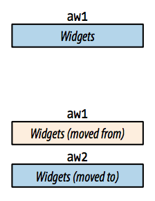

# Item 29: Assume that move operations are not present, not cheap, and not used.

Move semantics is arguably the premier feature of C++11. “Moving containers is now as cheap as copying pointers!” you’re likely to hear, and “Copying temporary objects is now so efficient, coding to avoid it is tantamount to premature optimization!” Such sentiments are easy to understand. Move semantics is truly an important feature. It doesn’t just allow compilers to replace expensive copy operations with comparatively cheap moves, it actually requires that they do so (when the proper conditions are ful‐ filled). Take your C++98 code base, recompile with a C++11-conformant compiler and Standard Library, and—shazam!—your software runs faster.

Move semantics can really pull that off, and that grants the feature an aura worthy of legend. Legends, however, are generally the result of exaggeration. The purpose of this Item is to keep your expectations grounded.

Let’s begin with the observation that many types fail to support move semantics. The entire C++98 Standard Library was overhauled for C++11 to add move operations for types where moving could be implemented faster than copying, and the imple‐ mentation of the library components was revised to take advantage of these opera‐ tions, but chances are that you’re working with a code base that has not been completely revised to take advantage of C++11. For types in your applications (or in the libraries you use) where no modifications for C++11 have been made, the existence of move support in your compilers is likely to do you little good. True, C++11 is willing to generate move operations for classes that lack them, but that happens only for classes declaring no copy operations, move operations, or destructors (see Item 17). Data members or base classes of types that have disabled moving (e.g., by deleting the move operations—see Item 11) will also suppress compiler-generated move operations. For types without explicit support for moving and that don’t qual‐ ify for compiler-generated move operations, there is no reason to expect C++11 to deliver any kind of performance improvement over C++98.

Even types with explicit move support may not benefit as much as you’d hope. All containers in the standard C++11 library support moving, for example, but it would be a mistake to assume that moving all containers is cheap. For some containers, this is because there’s no truly cheap way to move their contents. For others, it’s because the truly cheap move operations the containers offer come with caveats the container elements can’t satisfy.

Consider std::array, a new container in C++11. std::array is essentially a built- in array with an STL interface. This is fundamentally different from the other stan‐ dard containers, each of which stores its contents on the heap. Objects of such container types hold (as data members), conceptually, only a pointer to the heap memory storing the contents of the container. (The reality is more complex, but for purposes of this analysis, the differences are not important.) The existence of this pointer makes it possible to move the contents of an entire container in constant time: just copy the pointer to the container’s contents from the source container to the target, and set the source’s pointer to null:
```cpp
std::vector<Widget> vw1; 
// put data into vw1

//...
   
// move vw1 into vw2. Runs in 
// constant time. Only ptrs 
// in vw1 and vw2 are modified
auto vw2 = std::move(vw1);
```



std::array objects lack such a pointer, because the data for a std::array’s con‐ tents are stored directly in the std::array object:
```cpp
std::array<Widget, 10000> aw1; 
// put data into aw1
//...
// move aw1 into aw2. Runs in 
// linear time. All elements in 
// aw1 are moved into aw2
auto aw2 = std::move(aw1);
```


Note that the elements in aw1 are moved into aw2. Assuming that Widget is a type where moving is faster than copying, moving a std::array of Widget will be faster than copying the same std::array. So std::array certainly offers move support. Yet both moving and copying a std::array have linear-time computational com‐ plexity, because each element in the container must be copied or moved. This is far from the “moving a container is now as cheap as assigning a couple of pointers” claim that one sometimes hears.

On the other hand, std::string offers constant-time moves and linear-time copies. That makes it sound like moving is faster than copying, but that may not be the case. Many string implementations employ the small string optimization (SSO). With the SSO, “small” strings (e.g., those with a capacity of no more than 15 characters) are stored in a buffer within the std::string object; no heap-allocated storage is used. Moving small strings using an SSO-based implementation is no faster than copying them, because the copy-only-a-pointer trick that generally underlies the performance advantage of moves over copies isn’t applicable.

The motivation for the SSO is extensive evidence that short strings are the norm for many applications. Using an internal buffer to store the contents of such strings elim‐ inates the need to dynamically allocate memory for them, and that’s typically an effi‐ ciency win. An implication of the win, however, is that moves are no faster than copies, though one could just as well take a glass-half-full approach and say that for such strings, copying is no slower than moving.

Even for types supporting speedy move operations, some seemingly sure-fire move situations can end up making copies. Item 14 explains that some container opera‐ tions in the Standard Library offer the strong exception safety guarantee and that to ensure that legacy C++98 code dependent on that guarantee isn’t broken when upgrading to C++11, the underlying copy operations may be replaced with move operations only if the move operations are known to not throw. A consequence is that even if a type offers move operations that are more efficient than the corre‐

sponding copy operations, and even if, at a particular point in the code, a move oper‐ ation would generally be appropriate (e.g., if the source object is an rvalue), compilers might still be forced to invoke a copy operation because the corresponding move operation isn’t declared noexcept.

There are thus several scenarios in which C++11’s move semantics do you no good:
- No move operations: The object to be moved from fails to offer move opera‐ tions. The move request therefore becomes a copy request.
- Move not faster: The object to be moved from has move operations that are no faster than its copy operations.
- Move not usable: The context in which the moving would take place requires a move operation that emits no exceptions, but that operation isn’t declared noex cept.

It’s worth mentioning, too, another scenario where move semantics offers no effi‐ ciency gain:
- Source object is lvalue: With very few exceptions (see e.g., Item 25) only rvalues may be used as the source of a move operation.

But the title of this Item is to assume that move operations are not present, not cheap, and not used. This is typically the case in generic code, e.g., when writing templates, because you don’t know all the types you’re working with. In such circumstances, you must be as conservative about copying objects as you were in C++98—before move semantics existed. This is also the case for “unstable” code, i.e., code where the char‐ acteristics of the types being used are subject to relatively frequent modification.

Often, however, you know the types your code uses, and you can rely on their charac‐ teristics not changing (e.g., whether they support inexpensive move operations). When that’s the case, you don’t need to make assumptions. You can simply look up the move support details for the types you’re using. If those types offer cheap move operations, and if you’re using objects in contexts where those move operations will be invoked, you can safely rely on move semantics to replace copy operations with their less expensive move counterparts.

## Things to Remember
- Assume that move operations are not present, not cheap, and not used.
- In code with known types or support for move semantics, there is no need for assumptions.
